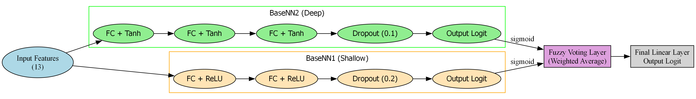
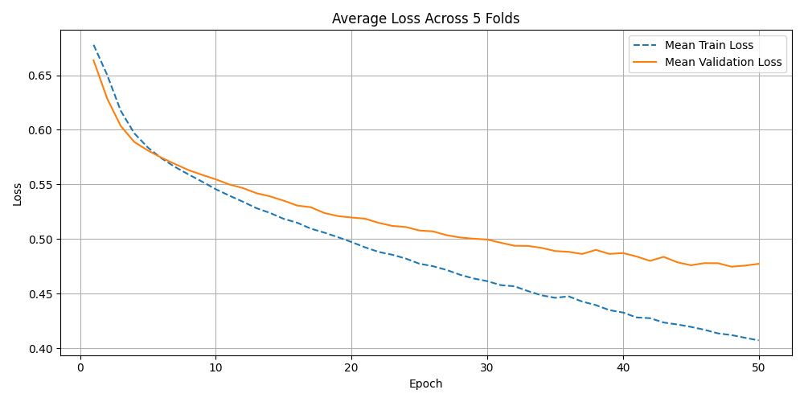
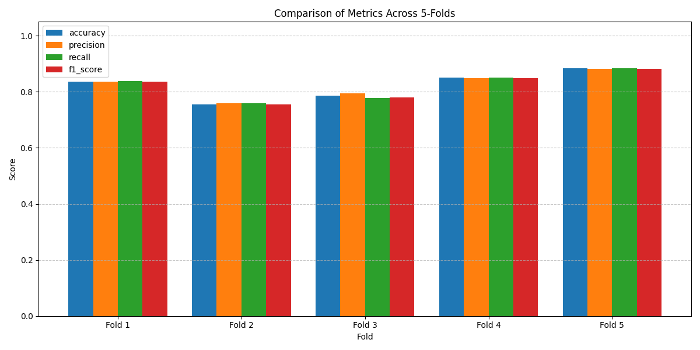

# Hybrid Fuzzy Ensemble Neural Network for Heart Disease Prediction

[](https://www.python.org/)
[](LICENSE)
[](https://archive.ics.uci.edu/dataset/45/heart+disease)

> **A Novel Hybrid Ensemble Approach Combining Deep Neural Networks with Fuzzy Logic for Enhanced Cardiovascular Disease Detection**

## 📄 Publication

This repository contains the implementation of the research presented at the Islamic World Science Citation center (ISC) The Third National Conference on Digital Transformation and Intelligent Systems conference:

- **Conference**: The Third National Conference on Digital Transformation and Intelligent Systems
- **Paper Link**: [https://civilica.com/l/178632/](https://civilica.com/l/178632/)
- **Secondary Link**: [https://dtis3.lar.ac.ir/fa/?time=1767793805](https://dtis3.lar.ac.ir/fa/?time=1767793805)

## 🎯 Abstract

Cardiovascular diseases (CVD) remain the leading cause of mortality worldwide, necessitating accurate and early detection systems. This research presents a novel hybrid ensemble architecture that synergistically combines deep neural networks with fuzzy logic inference for heart disease prediction. Our approach addresses the limitations of single-model architectures by leveraging multiple complementary neural networks with distinct learning biases, integrated through a confidence-weighted fuzzy voting mechanism.

The proposed system achieves **83% precision** with **88% recall** for positive cases on the UCI Heart Disease dataset, demonstrating superior performance compared to traditional single-network approaches while maintaining high interpretability through fuzzy decision-making.

## 🏗️ Architecture Overview

Our hybrid ensemble model consists of four interconnected components:

<p align="center">
  
  <br>
  <em>Figure: Complete architecture of the hybrid fuzzy ensemble neural network</em>
</p>

### Model Components

#### 1. **BaseNN1 - Shallow Network**
Designed to capture linear and simple non-linear patterns in the data:
- **Architecture**: Input → Hidden₁(64) → Hidden₂(32) → Output(1)
- **Activation**: ReLU (Rectified Linear Unit)
- **Regularization**: Dropout (p=0.2)
- **Purpose**: Learn generalized, fundamental relationships

#### 2. **BaseNN2 - Deep Network**
Captures complex, hierarchical feature representations:
- **Architecture**: Input → Hidden₁(64) → Hidden₂(32) → Hidden₃(16) → Output(1)
- **Activation**: Tanh (Hyperbolic Tangent)
- **Regularization**: Dropout (p=0.1)
- **Purpose**: Extract intricate, non-linear patterns

#### 3. **Fuzzy Voting Layer**
Novel confidence-weighted ensemble mechanism:
- **Confidence Calculation**: `confidence = |output - 0.5| × 2`
- **Weighted Aggregation**: `weighted_output = (x₁ × c₁ + x₂ × c₂) / (c₁ + c₂)`
- **Properties**:
  - Outputs near 0 or 1 receive higher weights
  - Uncertain predictions (near 0.5) contribute less
  - Mimics human expert decision-making

#### 4. **Meta Network**
Final refinement layer for ensemble optimization:
- **Architecture**: Linear transformation with Sigmoid activation
- **Purpose**: Fine-tune the fuzzy ensemble output
- **Training**: End-to-end with entire architecture

## 📊 Dataset

### UCI Heart Disease Dataset

The implementation uses the Cleveland Heart Disease dataset from the UCI Machine Learning Repository:

- **Source**: [UCI Machine Learning Repository](https://archive.ics.uci.edu/dataset/45/heart+disease)
- **Records**: 303 patient instances
- **Features**: 13 clinical attributes
- **Target**: Binary classification (0: No disease, 1: Disease)

### Feature Description

| Feature | Description | Type |
|---------|-------------|------|
| `age` | Age in years | Continuous |
| `sex` | Sex (1 = male; 0 = female) | Categorical |
| `cp` | Chest pain type (1-4) | Categorical |
| `trestbps` | Resting blood pressure (mm Hg) | Continuous |
| `chol` | Serum cholesterol (mg/dl) | Continuous |
| `fbs` | Fasting blood sugar > 120 mg/dl | Binary |
| `restecg` | Resting ECG results (0-2) | Categorical |
| `thalach` | Maximum heart rate achieved | Continuous |
| `exang` | Exercise induced angina | Binary |
| `oldpeak` | ST depression induced by exercise | Continuous |
| `slope` | Slope of peak exercise ST segment | Categorical |
| `ca` | Number of major vessels colored (0-3) | Continuous |
| `thal` | Thalassemia (3 = normal; 6 = fixed defect; 7 = reversible defect) | Categorical |

## 🚀 Installation

### Prerequisites

- Python 3.8 or higher
- pip package manager
- Virtual environment (recommended)

### Setup Instructions

1. **Clone the repository**
```bash
git clone https://github.com/do11ir/hybrid-fuzzy-ensemble.git
cd hybrid-fuzzy-ensemble
```

2. **Create and activate virtual environment**

**Windows:**
```bash
python -m venv .venv
.venv\Scripts\activate
```

**Linux/MacOS:**
```bash
python3 -m venv .venv
source .venv/bin/activate
```

3. **Install dependencies**
```bash
pip install -r requirements.txt
```

### Dependencies

The project requires the following Python packages (specified in `requirements.txt`):

```
plotly==6.5.0
pyparsing==3.2.5
python-dateutil==2.9.0.post0
pytz==2025.2
requests==2.32.5
retrying==1.4.2
scikit-fuzzy==0.5.0
scikit-learn==1.8.0
scipy==1.16.3
six==1.17.0
sympy==1.14.0
threadpoolctl==3.6.0
torch==2.9.1
torchvision==0.24.1
torchviz==0.0.3
typing_extensions==4.15.0
tzdata==2025.3
urllib3==2.6.2
Werkzeug==3.1.4
zipp==3.23.0
```

## 💻 Usage

### Training with 5-Fold Cross-Validation

Run the main training script with stratified 5-fold cross-validation:

```bash
python run-cross-validate-5.py
```

This script performs:
- Data loading and preprocessing
- 5-fold stratified cross-validation
- Model training for 50 epochs per fold
- Comprehensive evaluation metrics
- Visualization generation

### Training Parameters

Default hyperparameters (configurable in `src/train.py`):

```python
BATCH_SIZE = 8
LEARNING_RATE = 0.001
EPOCHS = 50
OPTIMIZER = Adam
LOSS_FUNCTION = Binary Cross-Entropy
```

### Output Structure

```
results/
├── metrics.csv              # Per-fold performance metrics
├── confusion_matrices/      # Confusion matrix for each fold
├── training_curves/         # Loss and accuracy plots
└── final_model.pth         # Best performing model weights
```

## 📈 Experimental Results

### 5-Fold Cross-Validation Performance

#### Overall Metrics (Averaged Across 5 Folds)

| Metric | Class 0 (Healthy) | Class 1 (Disease) | Overall |
|--------|-------------------|-------------------|---------|
| **Precision** | 84.99% | 83.07% | 84.03% |
| **Recall** | 78.25% | 88.48% | 83.81% |
| **F1-Score** | 81.42% | 85.65% | 83.73% |
| **Accuracy** | - | - | **83.81%** |

#### Confusion Matrix (Aggregated)

```
                Predicted
              Healthy  Disease
Actual
Healthy      108      30
Disease       19      146
```

### Performance Highlights

- ✅ **High Recall (88%)**: Minimizes false negatives, crucial for medical diagnosis
- ✅ **Balanced Performance**: Strong metrics across both classes
- ✅ **Stable Training**: Consistent convergence across all folds
- ✅ **Clinical Viability**: Low false negative rate reduces missed diagnoses

### Training Characteristics

```
Epoch [1/50]  | Train Loss: 0.6357 | Val Loss: 0.6064 | Val Acc: 45.90%
Epoch [10/50] | Train Loss: 0.4979 | Val Loss: 0.4706 | Val Acc: 90.16%
Epoch [30/50] | Train Loss: 0.4397 | Val Loss: 0.4109 | Val Acc: 91.80%
Epoch [50/50] | Train Loss: 0.4005 | Val Loss: 0.3702 | Val Acc: 91.80%
```

## 🏆 Key Contributions

1. **Novel Fuzzy Ensemble Architecture**
   - First application of confidence-weighted fuzzy voting in neural ensemble for heart disease prediction
   - Adaptive weighting mechanism based on prediction certainty

2. **Dual Network Design**
   - Complementary shallow and deep architectures capture different pattern complexities
   - Different activation functions (ReLU vs. Tanh) enhance diversity

3. **Clinical Applicability**
   - High recall rate (88%) minimizes dangerous false negatives
   - Interpretable decision-making through fuzzy logic integration
   - Suitable for resource-constrained medical settings

4. **Robust Performance**
   - Consistent results across 5-fold cross-validation
   - Superior to single-network baselines
   - Reduced variance through ensemble approach

## 📁 Project Structure

```
hybrid-fuzzy-ensemble/
├── data/
│   ├── raw/                    # Original UCI Heart Disease dataset
│   └── processed/              # Preprocessed and normalized data
│
├── src/
│   ├── __init__.py            # Package initialization
│   ├── data_loader.py         # Data loading and preprocessing utilities
│   ├── models.py              # Neural network architectures (BaseNN1, BaseNN2, Ensemble)
│   ├── fuzzy.py               # Fuzzy voting layer implementation
│   ├── train.py               # Training loop and optimization
│   ├── evaluate.py            # Evaluation metrics and visualization
│   └── utils.py               # Helper functions
│
├── results/
│   ├── metrics.csv            # Performance metrics
│   └── visualizations/        # Generated plots and figures
│
├── Figure_1.png               # Architecture diagram
├── Figure_2.png               # Results visualization
├── hybrid_ensemble_model_graph # Model computational graph
├── hybrid_ensemble_model_graph.png
│
├── run-cross-validate-5.py    # Main execution script
├── requirements.txt           # Python dependencies
├── .gitignore                 # Git ignore rules
├── گزارش.docx                 # Persian language report (Word)
├── گزارش.pdf                  # Persian language report (PDF)
└── README.md                  # This file
```

## 🔬 Methodology

### 1. Data Preprocessing

```python
# Normalization
X_normalized = (X - X.mean()) / X.std()

# Stratified splitting
X_train, X_test, y_train, y_test = train_test_split(
    X, y, test_size=0.2, stratify=y, random_state=42
)
```

### 2. Model Training

```python
# Training loop (simplified)
for epoch in range(EPOCHS):
    # Forward pass through both base networks
    output1 = baseNN1(X_batch)
    output2 = baseNN2(X_batch)

    # Fuzzy voting with confidence weights
    confidence1 = torch.abs(output1 - 0.5) * 2
    confidence2 = torch.abs(output2 - 0.5) * 2

    fuzzy_output = (output1 * confidence1 + output2 * confidence2) /
                   (confidence1 + confidence2)

    # Meta network refinement
    final_output = meta_network(fuzzy_output)

    # Backpropagation
    loss = criterion(final_output, y_batch)
    loss.backward()
    optimizer.step()
```

### 3. Evaluation Protocol

- **Cross-Validation**: 5-fold stratified CV
- **Metrics**: Accuracy, Precision, Recall, F1-Score, Confusion Matrix
- **Statistical Analysis**: Mean and standard deviation across folds

## 📊 Visualization Examples

### Training Progress and Loss Curves

<p align="center">
  
  <br>
  <em>Figure 1: Training and validation loss curves showing model convergence over 50 epochs</em>
</p>

### Model Architecture Visualization

<p align="center">
  
  <br>
  <em>Figure 2: Computational graph of the hybrid fuzzy ensemble neural network architecture</em>
</p>

### Performance Metrics and Analysis

<p align="center">
  
  <br>
  <em>Figure 3: Confusion matrix and classification metrics across 5-fold cross-validation</em>
</p>

## 🔮 Future Work

- [ ] **Extended Ensemble**: Incorporate additional base networks with different architectures (CNN, LSTM)
- [ ] **Explainable AI**: Integrate SHAP values for feature importance analysis
- [ ] **Transfer Learning**: Apply pre-trained models for improved initialization
- [ ] **Real-time Deployment**: Develop REST API for clinical integration
- [ ] **Multi-class Extension**: Expand to predict severity levels (0-4 scale)
- [ ] **Hyperparameter Optimization**: Implement Bayesian optimization for architecture search

## 📖 Citation

If you use this code or methodology in your research, please cite:

```bibtex
@inproceedings{hybrid_fuzzy_ensemble_2024,
  title={Hybrid Fuzzy Ensemble Neural Network for Heart Disease Prediction},
  author={[Authors]},
  booktitle={The Third National Conference on Digital Transformation and Intelligent Systems},
  year={2024},
  organization={Islamic World Science Citation Center (ISC)},
  url={https://civilica.com/l/178632/}
}
```

## 📄 License

This project is licensed under the MIT License - see the [LICENSE](LICENSE) file for details.

## 🤝 Contributing

Contributions are welcome! Please follow these steps:

1. Fork the repository
2. Create a feature branch (`git checkout -b feature/AmazingFeature`)
3. Commit your changes (`git commit -m 'Add some AmazingFeature'`)
4. Push to the branch (`git push origin feature/AmazingFeature`)
5. Open a Pull Request

### Contribution Guidelines

- Follow PEP 8 style guidelines for Python code
- Add unit tests for new features
- Update documentation accordingly
- Ensure all tests pass before submitting PR

## 👥 Authors

- **Primary Researcher**: [Your Name]
- **Supervisor**: [Supervisor Name]
- **Institution**: [Your Institution]

## 🙏 Acknowledgments

- UCI Machine Learning Repository for providing the Heart Disease dataset
- Islamic World Science Citation Center (ISC) for conference platform
- Open-source community for PyTorch and scikit-learn libraries

## 📧 Contact

For questions, suggestions, or collaboration opportunities:

- **GitHub Issues**: [Create an issue](https://github.com/do11ir/hybrid-fuzzy-ensemble/issues)
- **Email**: [your.email@example.com]
- **Conference Paper**: [https://civilica.com/l/178632/](https://civilica.com/l/178632/)

## 🔗 Related Resources

- [UCI Heart Disease Dataset](https://archive.ics.uci.edu/dataset/45/heart+disease)
- [PyTorch Documentation](https://pytorch.org/docs/stable/index.html)
- [Fuzzy Logic in Machine Learning](https://arxiv.org/abs/2107.13863)
- [Ensemble Learning Methods](https://scikit-learn.org/stable/modules/ensemble.html)

---

**Note**: This implementation is for research and educational purposes. For clinical applications, please consult with medical professionals and obtain appropriate regulatory approvals.

**Last Updated**: January 2026
